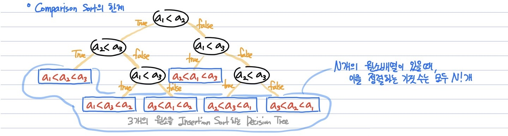

# 6가지 Comparsion Sort의 한계
**6-Comparision Sort**  
- Bubble Sort
- Selection Sort
- Insertion Sort
- Quick Sort
- Merge Sort
- Heap Sort
___
**비교 정렬 알고리즘의 한계**

  - n개의 원소에 대한 결정 트리 모델에서 Leaf node는 총 n!개 존재한다.
  - 즉, Six-Comparision Sort는 아무리 빠른 알고리즘일지라도 Leaf node까지 도달하는데 log(n!)(=nlogn)만큼의 시간이 걸린다.
  - 이러한 O(nlogn)을 줄일 수 있는 방법은 Comparision을 하지 않는 것
  **=> 계수 정렬(Counting Sort), 기수 정렬(Radix Sort) **
