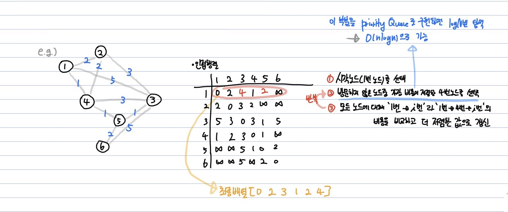

# 다익스트라(Dijkstra) 알고리즘

**Abstract**
  - DP를 활용한 **최단경로탐색** 알고리즘
  - 하나의 최단 거리를 구할 때 그 이전 까지 구했던 최단거리 정보를 그대로 사용

---
**Process**
  1. 출발 노드를 설정
  2. 출발 노드를 기준으로 각 노드의 최소 비용을 저장
  3. 방문하지 않은 노드 중 가장 비용이 적은 노드를 선택
  4. 선정된 노드를 거쳐서 특정한 노드로 가는 경우를 고려하여 최소 비용을 갱신
  5. 3,4 단계를 반복



---
**Source Code**
```java
    private int min(int a, int b){
        if (a<b) return a;
        else return b;
    }
    
    public int solution(int N, int[][] road, int K) {
        int answer = 0;
        int[][] graph = new int[N][N];
        for(int i = 0; i < N; i++){
            for(int j = 0; j < N; j++){
                if(i == j) graph[i][j] = 0;
                else graph[i][j] = INF;
            }
        }
        
        for(int[] info : road){
            int src = info[0]-1, des = info[1]-1, cost = info[2];
            graph[src][des] = min(graph[src][des], cost);
            graph[des][src] = graph[src][des];
        }
        
        int[] dist = new int[N];  // 1번 마을에서 다른 마을까지의 비용
        boolean[] visited = new boolean[N];  // false -> 아직 방문하지 않음, true -> 이미 방문
        
        for(int i = 0; i < N; i++){ // dist, visited 배열 초기화
            dist[i] = graph[0][i];
            visited[i] = false;
        }
        
        visited[0] = true;
        for(int i = 0; i < N-2; i++){ // N-2개의 마을을 방문하는 동안 반복(1번과 마지막 마을 제외)
            int min = INF;
            int idx = 0;  // 1번 마을에서 방문하지 않은 마을 중 가장 비용이 적은 마을 번호를 탐색
            for(int j = 1; j < N; j++){
                if(dist[j] < min && !visited[j]){
                    min = dist[j];
                    idx = j;
                }
            }
            visited[idx] = true;
            
            // i번 노드에서 선정된 노드(idx)를 거쳐서 특정한 노드(j)로 가는 경우를 고려하여 최소 비용을 갱신
            for(int j = 1; j < N; j++){
                if(dist[j] > dist[idx] + graph[idx][j]){
                    dist[j] = dist[idx] + graph[idx][j];
                }
            }
        }
        
        for(int D : dist){
            if(D <= K) answer++;
        }
        return answer;
    }
```
---
**관련 문제**  
  - https://programmers.co.kr/learn/courses/30/lessons/12978?language=java
