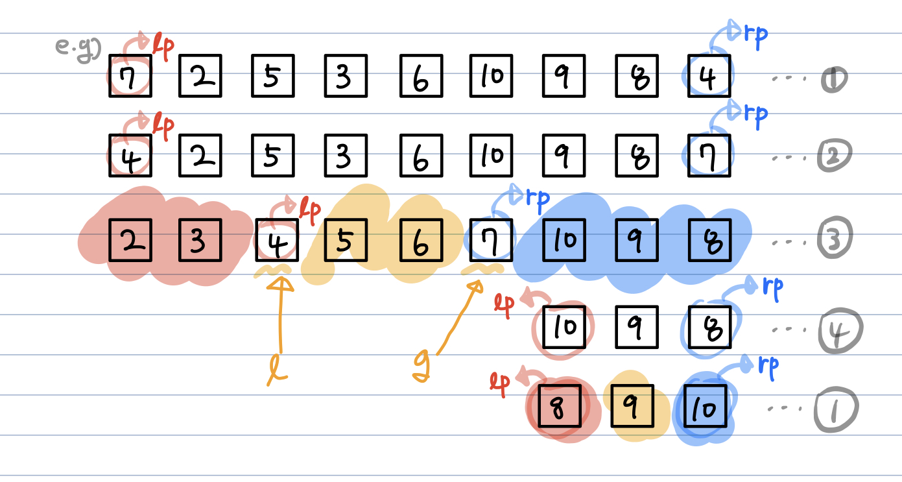

# 이중 피벗 퀵 정렬(Dual Pivot Quick Sort)  
**Abstract**
  - java의 Arrays.sort()가 사용하는 알고리즘
  - 실제로는 Insertion Sort와 Dual Pivot Quick Sort를 결합해서 사용하지만 여기선 삽입정렬이 같이 있는것이 아닌 2개의 Pivot을 사용하는 경우만 저이
  - Insertion Sort는 이미 정렬된 배열에 대해 O(n) _(값을 한번만 비교하고 종료)_를 사용하므로 Quick Sort의 *불균등 분할*이라는 단점을 개선하기 위해 사용
---
**Process**
  1. 기존 Quick Sort는 배열에서 **하나의 원소**를 선정, 여기서는 말 그대로 2개의 원소를 선정 -> *Dual Pivot*
    1. lp(left pivot), rp(right pivot)
    2. 두 pviot을 기준으로 3개의 영역으로 분할 **x < lp, lp < x < rp, rp < x** *(이상 영역1, 영역2, 영역3)* 
  2. lp > rp인 경우 lp와 rp를 교환
  3. 3개의 영역으로 분할
  4. 각각의 영역에 대해 다시 Dual Pivot Quick Sort 진행
  
---
**장점**
  - Quick Sort보다 좋은 성능
---
**단점**
  - 여전히 worst case에선 **O(n^2)**의 시간복잡도(이때문에 java에선 복합적인 방식으로 해결)
---
**Source Code**
  - Conquer
  ```java
  public void DualPivotQuickSort(int[] arr, int left, int right){
    // l : 영역 1에 들어갈 다음 변수의 인덱스
    // g : 영역 3에 들어갈 다음 변수의 인덱스
    // k : 현재 인덱스, 적절한 영역에 들어가게 해주는 변수
    
    if(left <= right){
      int lp = arr[left]; // 1번 과정
      int rp = arr[right]; // 1번 과정
      
      if(arr[lp] > arr[rigth]){
        swap(arr, lp, rp); // 2번 과정
      }
      
      int l = left + 1; // left는 lp의 인덱스이므로 +1
      int g = right - 1; // right는 rp의 인덱스 이므로 -1
      int k = left + 1;
      
      while(k <= g){ // 서로 엇갈릴때까지 진행(모든 원소에 대해 검사)
      
        //arr[k]가 lp보다 작다면 1번 영역에 들어감
        if(arr[k] < lp){
          swap(arr, k, l);
          l++;
        }
        
        //2번, 3번영역
        else{
          if(arr[k] > rp){ // 3번 영역에 들어가는 경우
            while(arr[g] > rp && k <= g){ // 3번 영역에 arr[k]가 들어가도록 arr[k] > rp를 만족하는 인덱스 g를 찾음
              g--;
            }
            // arr[k]는 3번 영역에 들어갈 값이므로 위에 while문에서 찾은 arr[g]와 교환
            // arr[k]는 3번 영역에, arr[g]는 2번영역에 들어가게된디.
            swap(arr, k, g);
            g--;
            
            // 이때의 arr[k]는 위에 swqp(arr, k, g)을 하기전 arr[g]값
            if(arr[k] < lp){ // swap이전 arr[g]는 rp보다 작은지만 검사했으므로 1번 영역에 들어갈수도 있음, 따라서 이를 검사
              swap(arr, k, l);
              l++;
            }
          }
        }
        k++;
      }
      
      l--; g++; // l과 g는 각각 다음 인덱스를 표현했으므로 1씩 감소, 증가
      swap(arr, left, l); // lp가 적절한 위치에 오도록 arr[left](=lp)와 arr[l]을 교환
      swap(arr, right, g); // rp가 적절한 위치에 오도록 arr[right](=rp)와 arr[g]를 교환
      DualPivotQuickSort(arr, left, l-1); // 영역 1
      DualPivotQuickSort(arr, l+1, g-1); // 영역 2
      DualPivotQuickSort(arr, g+1, right); // 영역 3
  ```
