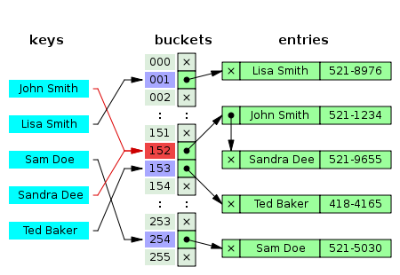

# 해시 테이블(Hash Table, Hash Map)
**Abstract**
  - 탐색을 줄이기 위해 input에 대한 key값을 얻어내서 관리
  - key, value 쌍을 갖는 자료구조

---
**Hash function**
  - input값을 통해 레코드가 저장된 주소(or Index)를 산출하는 함수

---
**Hash Collision**
  - 서로 다른 input이라도 동일한 key값이 나올 수 있음
  - 해시 함수의 **입력값은 무한** 하지만, **출력의 가짓수는 유한** 하므로 **해시충돌은 반드시 발생한다 _(비둘기집원리)_**

---
**해시 충돌 대처법**
  1. 체이닝(Chaining)  
  
    - 연결리스트를 할당하여, 동일한 key값이 나온다면(해시충돌이 발생했다면) 연결리스트로 데이터를 연결  
    - **삽입, 삭제에 용이하지만 동적인 공간을 추가로 할당해야함**  

  2. 개방 주소법  
    - 해시 충돌이 발생하면 다른 주소를 계산하여 할당하는 것  
    2-1. 선형 탐색  
      - 해시 충돌시 다음버켓, 이미 데이터가 있다면 그 다음 버켓으로 건너뛰어 삽입  
      - **검색에 많은 시간, 계산이 단순, 테이블 내에 데이터들이 일정한 키값으로 모임**  
      
    2-2. 제곱 탐색  
      - n^2만큼 옆칸(1칸, 4칸, 9칸, 16칸, ...)으로 이동하여 검사  
      - 일정한 key값으로 모이진 않지만, 모든 공간을 검사하지 못한다.    
        
    2-3. 이중 해시  
      - 해시 충돌시 **다른 해시 함수를 한 번 더 적용**
      
    2-4. 재해싱
      - Hash Table의 크기를 늘리고, 새로운 Hash Table의 크기에 맞추어 다시 모든 데이터를 해싱
      - **상당한 비용 발생**
      
  
