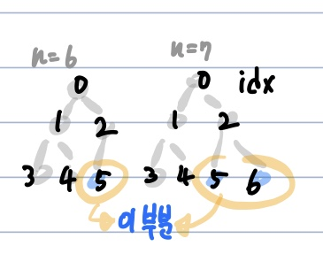

# 힙 정렬(HeapSort)
**Abstract**
  - 불안정 정렬
  - **완전 이진 트리**를 기반으로 하는 Heap 자료구조를 기반으로 하는 정렬 방식
  - 완전 이진 트리? 
    > 왼쪽부터 차례대로 삽입하는 이진 트리
---
**Process**
  1. Max Heap을 구성
  2. 현재 root에는 가장 큰 값이 존재, 루트의 값을 마지막 요소와 swap
  3. 마지막 요소에 가장 큰 값이 들어가 있으므로 힙의 사이즈를 하나 줄여서 다시 Max Heap을 구성
  4. 사이즈가 0보다 큰 동안 1씩 감소하며 2단계를 반복
---
**Source Code**
```java
public void HeapSort(int[] array){
  int n = array.length;
      
  // Max Heap 초기화
  for(int i = n/2-1; i>=0; i++){
  heapify(array, n, i); // 1번과정 - 일반 배열을 힙으로 구성
  }
      
  // 2,3,4번 과정(Extract)
  for(int i = n-1; i > 0; i--){
    swap(array, 0, i); // 2번과정 - 루트(0)의 값을 마지막 요소와 swap
    heapify(array, i, 0); // 힙의 사이즈를 하나 줄여서(i) 다시 Max Heap을 구성
  }
}
```

**_i를 n-2/1부터 시작하여 1씩 감소하는 이유_**
- i를 n/2-1부터 시작하면 l = n-1, r = n이 된다.
- 즉, 배열을 완전 이진트리로 구성할때 leat node가 있는 가장 갚고 우측에 있는 노드부터 시작하여 root까지 인덱스를 1씩 줄여가며 반복

   
```java
public void heapify(int[] array, int n, int i){
  int p = i;
  int l = i*2 + 1; // i번 노드의 왼쪽 자식이 될 인덱스
  int r = i*2 + 2; // i번 노드의 오른쪽 자식이 될 인덱스
      
  // left child
  if(l<n && array[p] < array[l]) { // 최대 힙을 구성해야 하므로 자식노드가 부모느도보다 크다면 p를 갱신
    p = l;
  }
  
  // right child
  if(r<n && array[p] > array[r]) { // 최대 힙을 구성해야 하므로 자식노드가 부모느도보다 크다면 p를 갱신
    p = r;
  }
  
  // 부모노드 < 자식노드인 경우(= Max Heap을 만족하지 못하는 경우)
  if(p != i){ // i = index of parent node
    swap(array, p, i); // 자식노드(p)가 부모노드(i)보다 컸다면 swap ( array[i] <=> array[p] )
    heapify(array, n, p); // array[p]엔 (swap전)array[i] 값이 오게되는데 p번 노드를 기준으로 Maxheap을 구성하기 위해다시 반복
```
