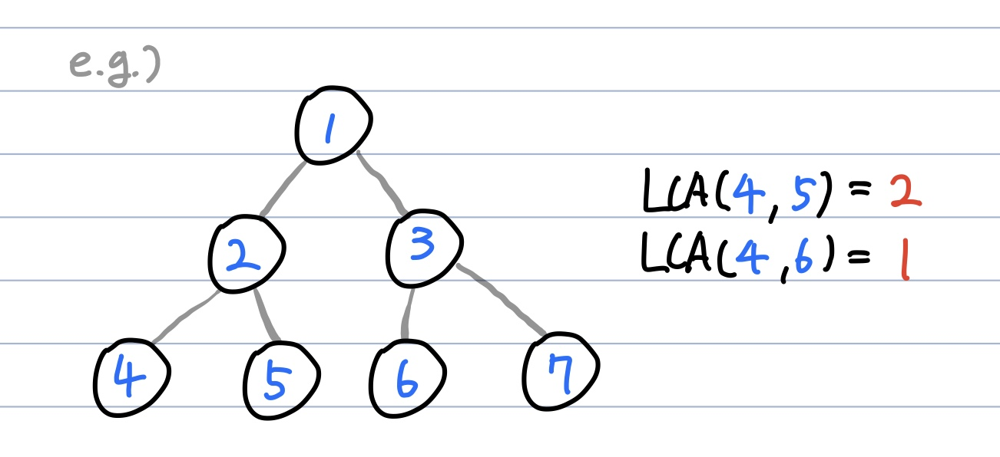

# 최소 공통 조상(Lowest Common Ancestor, LCA) 알고리즘
**Abstract**
  - 트리에서 두 정점이 만나는 최초 부모 정점을 찾는 것
   

---
**Process**
  - Level이 같은 각 노드에서 부모를 타고 올라가서 같은 부모를 찾는다.
  - Level이 다르다면 같아질 때 까지 더 depth가 깊은 노드를 해당 노드의 parent로 변경한다. 
  
--- 
**Source Code**
```c
void LCA(int a, int b){
  int[] depth = {0, 1, 1, 2, 2, 2, 2}; // depth[i]는 i번 노드의 depth
  int[] parent = {0, 1, 1, 2, 2, 3, 3}; // parent[i]는 i번 노드의 부모 노드 번호

  while(True){
    if(depth[a]==depth[b]){
      if(parent[a]==parent[b]){
        return parent[a];
      }
      else{
        a = parent[a];
        b = parent[b];
      }
    }
    else if(depth[a] > depth[b]){
      a = parent[a];
    }
    else {
      b = parent[b];
    }
  }
}
``` 
