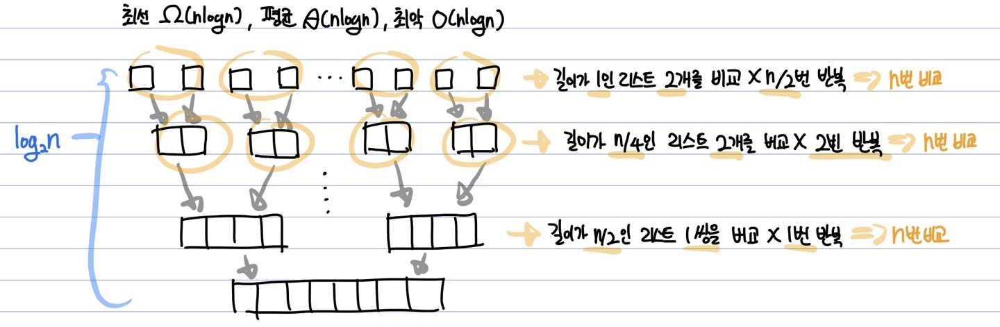

# 이중 피벗 퀵 정렬(Dual Pivot Quick Sort)  
**Abstract**
  - 불안정 정렬
  - **분할정복**을 통해 정렬
  > *분할정복이란?* **큰 문제를 작은 문제단위로 쪼개면서 해결해나가는 방식**
---
**Process**
  1. 배열의 원소가 1개가 될때까지 분리
  2. 배열의 원소가 1일때부터 다시 n이 될때까지 비교하며 병합
---
**Source Code**
  ```java
  public void MergeSort(int[] arr, int left, int right){
    if(left < right){
      int mid = (left + right) / 2;
      
      MergeSort(arr, left, mid);
      MergeSort(arr, mid+1, right);
      Merge(arr, left, mid ,right); // merger sort의 핵심이 되는 부분 -> 다시 비교하며 병합
    }
  }
  ```
  ```java
  public static void Merge(int[] array, int left, int mid, int right){
      int[] L = Arrays.copyOfRange(array, left, mid+1);
      int[] R = Arrays.copyOfRange(array, mid+1, right+1);
      
      int i = 0, j = 0, k = left;  // i는 L의 인덱스, j는 R의 인덱스, k는 새로운 병합될 배열의 인덱스를 표현
      int ll = L.lenght, rl = R.length;
      
      while(i < ll && j < rl){
        if(L[i] <= R[i]){
           array[k] = L[i++];
        }
        else{
          array[k] = R[j++];
        }
        k++;
      }
      
      // L,R의 남은 부분이 있다면 마저 붙이기
      while(i < ll) array[k++] = L[i++];
      while(j < rl) array[k++] = R[j++];
    }
    ```  
---
**Quick Sort와의 차이점**
  - Quick Sort : Pivot을 통해 정렬(partition) -> 2개의 영역으로 분리(divide) **이 두개의 영역에 대해 각각 비교**
  - Merge Sort : 영역을 쪼갤 수 있을때 까지 분리(MergeSort) -> 더 이상 쪼갤수 없다면 정렬(병합)(Merge)
---
**시간복잡도**
  - 최선, 평균, 최악 모두 O(nlogn)
  
---
**공간복잡도**
  - O(n)
---
**장점**
  - LinkedList 자료구조를 사용할시 효율적(L, R 두 영역에 대해 원소를 순차적으로 연결하여 탐색하므로)
  - 좋은 성능(O(nlogn))  *locality를 고려했을때 좋다고 표현할 수 있을까?*
**단점**
  - 별도의 임시 배열이 필요(In-place sorting X)
