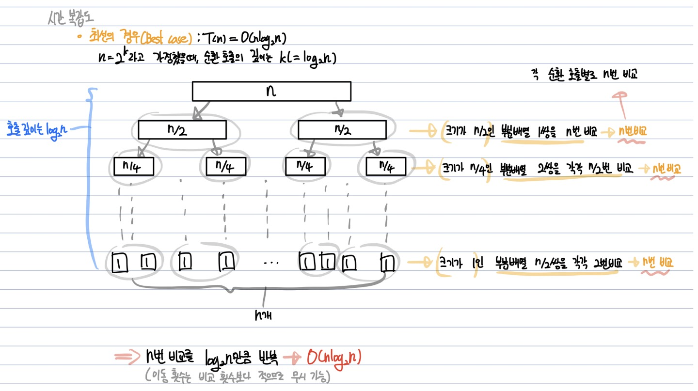
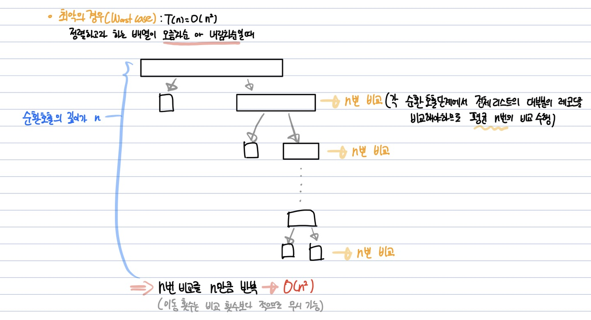

# 퀵 정렬(Quick Sort)  
**Abstract**
  - **분할정복**을 통해 정렬
  - 불안정 정렬, 다른 원소와의 비교만으로 정렬을 수행하는 비교 정렬
  - Merge Sort와 달리 배열은 **비균등**하게 분할  
---

**Process**
  1. 배열에서 **하나의 원소**를 선정 -> *Pivot*
  2. Pivot 앞에는 Pivot보다 작은 값이, 뒤에는 Pivot 보다 큰 값이 오도록 배열을 분리 -> *Divide*
  3. 분할된 두 영역에 대해 1단계부터 다시 반복 -> *Recursion*  
      **_=>_** 재귀호출이 한번 진행될떄마다 **최소한 하나의 원소는 위치가 정해지므로** 반드시 정렬됨을 보장 가능  
---

**Source Code**
  - Conquer
  ```java
  public void quickSort(int[] array, int left, int right) {

      if(left >= right) return;

      int pi = partition(array, left, right); // 분할

      // 부분 배열의 크기가 충분히 작지 않으면 Pivot을 제외하고 두 부분 배열을 대상으로 순환 호출
      quickSort(array, left, pi-1); // 정복
      quickSort(array, pi+1, right); // 정복

  }
  ```
  
  - Divide
  ```java
  public int partition(int[] array, int left, int right){
  
      int pivot = array[left]; // 1. pviot 선택
      int i = left, j = right;
      
      while(i < j){ // 5. 2번부터 4번 과정을 반복
          while(pivot < array[j]){ // 2.오른쪽(j)에서 왼쪽(i)로 가며 pviot 보다 작은 수를 탐색
              j--;
          }
          
          while(i < j && pivot >= array[i]){  // 3. 왼쪽에서 오른쪽으로 가며 pivot 보다 큰 수를 탐색
              i++;
          }
          swap(array, i, j);  // 4. pivot보다 오른쪽에 작은수, 왼쪽에 큰 수를 서로 교환
      }
      
      // 6. 2,3번 과정이 더이상 진행 불가능하면 array[i]와 pivot을 교환
      array[left] = array[i];
      array[i] = pivot;
      
      // 7. 
      // 6번 단계를 수행한 후 array[i]에는 pivot의 값이 들어가게 되고,
      // i를 기준으로 왼쪽엔 pivot보다 작은 값, 오른쪽엔 pivot보다 큰 값이 오게됨.
      return i;
  }
  ```
---

**Quick Sort 개선**
  - 원인 : Pivot이 *최소나 최대값으로 지정되어* **Partition이 균등하게 나누어지지 않을때** **_O(n^2)_** 의 시작복잡도를 가짐
           (e.g. 이미 오름차순 or 내림차순 정렬되어 있는 배열)
           
  - 해결 : Pivot을 **중간 요소**로 선택하여 해결 가능
  ```java
  public int partition(int[] array, int left, int right){
  
      int mid = (left + right) / 2; // 1. pviot 선택
      int i = left, j = right;
      
      // 생략
  }
  ```
---
**시간 복잡도**
  - 최선의 경우 : T(n) = O(nlogn)
    
  
  - 최악의 경우 : T(n) = O(n^2)
  
---
**공간 복잡도**
  - 주어진 배열 내에서 swap 연산이 이루어지므로 O(n)
---
**장점**
  - 불필요한 데이터의 이동을 줄이고, 먼거리의 데이터를 교환
  - 한번 결정된 pivot은 다음 연산에서 제외됨
  - 정렬하고자 하는 배열 내에서 교환되므로, 추가적인 메모리 공간 필요 x
---
**단점**
  - 불안정 정렬
  - 정렬된 배열에 대해 *Quick Sort의 불균형 분할*에 의해 수행시간이 더 걸림
---
**Quick Sort가 빠른 이유**
  1. 불필요한 Data 이동이 적다.(pviot을 기준으로 i, j만을 변경(두 영역으로만))  
    - Bubble Sort의 경우 n^2번 비교, n^2번 swap을 수행
  2. Locality(짧은 시간동안 반복적으로 접근하는 데이터의 성질)  
    - 불필요한 Data 이동이 적으므로 **Cache에 반복적으로 접근 가능**
       1. cache miss가 적고, physical memory에 접근하는 경우가 상대적으로 적음
       2. 한정적인 범위에서만(pivot을 기준으로 좌우로 나뉨) Data 들이 움직임
       **_=>_ 하드웨어 적으로 효율적인 방법(Cache의 도움을 받을 수 있다)** 
  3. vs. Merge Sort  
    - Merge Sort의 경우 **끝에서 끝으로 계속 왔다갔다** 하며 데이터를 탐색
    - 이로인해 cache의 page가 계속해서 바뀌어 Locality가 떨어짐
     
