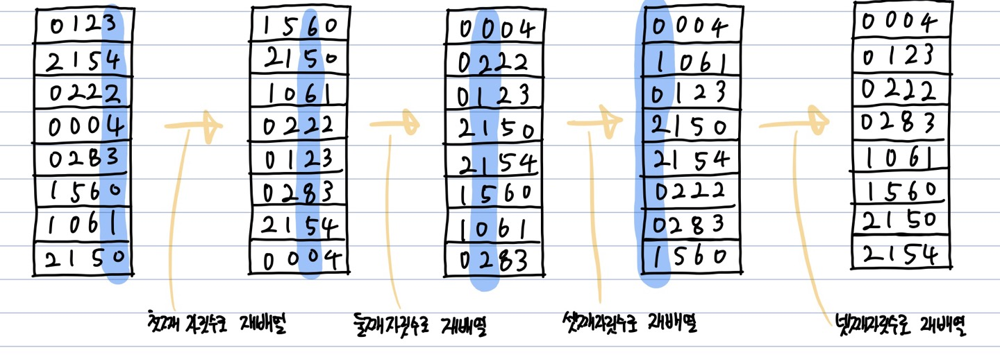

# 기수 정렬(Radix Sort)
**Abstract**
  - **데이터를 구성하는 기본요소(_Radix_)** 를 이용하여 정렬하는 방식
  - 안정정렬
___
**시간복잡도**
O(d*(n+b)) = O(n)  
d = 정렬할 숫자의 자릿수  
b = 10으로 고정(계수 정렬에서 k)  
___
**장점**
  - 문자열, 정수 정렬 가능
___
**단점**
  - 자릿수가 없는 것(e.g.) 부동 소수점)은 정렬할 수 없음
  - 중간결과를 저장할 bucket이 필요함
  - 입력이 모두 k 자릿수 이하의 자연수인 특수한 경우에서만 사용 가능
___
**Process**  

  e.g.) [5 5 3 4 5 1 0 4 1 3 0 2 4 2 3 0] 을 정렬
  1. 숫자별 등장 횟수를 count  

| 숫자 | 0 | 1 | 2 | 3 | 4 | 5 |
|:---:|:---:|:---:|:---:|:---:|:---:|:---:|
| 등장횟수 | 3 | 2 | 2 | 3 | 3 | 3 |

  2. 누적합을 계산 **(크기가 n인 Counting 배열을 추가로 선언)**

| 숫자 | 0 | 1 | 2 | 3 | 4 | 5 |
|:---:|:---:|:---:|:---:|:---:|:---:|:---:|
| 등장횟수 | 3 | 2 | 2 | 3 | 3 | 3 |
| 누적합 | 3 | 5 | 7 | 10 | 13 | 16 |

  3. 누적합을 기반으로 정렬

| index | 1 | 2 | 3 | 4 | 5 | 6 | 7 | 8 | 9 | 10 | 11 | 12 | 13 | 14 | 15 | 16 |
|:---:|:---:|:---:|:---:|:---:|:---:|:---:|:---:|:---:|:---:|:---:|:---:|:---:|:---:|:---:|:---:|:---:|
| number | 0 | 0 | 0 | 1 | 1 | 2 | 2 | 3 | 3 | 3 | 4 | 4 | 4 | 5 | 5 | 5 |

---
**장점**
  - **O(n)** 의 시간복잡도
  - 알파벳(26개)으로 이루어진 Suffix array를 구할때 유용
---
**단점**
  - Counting 배열에서 등장하는 최댓값만큼 추가적인 메모리 공간 필요 **_=> 메모리 낭비가 심하다_**  
  (가령, 배열에 '10억'이라는 숫자가 포함되어 있다면 '10억'만큼의 공간이 필요)
---
**Source Code**
```c
int arr[5]; // [5,4,3,2,1]
int sorted_arr[5];

// Counting 배열을 선언할 추가적인 메모미 공간 필요
int counting[6]; // 1. Counting배열의 사이즈를 최대값 5까지 담기도록 선언(1이 시작 index)

// 2. Counting 배열의 각 원소별로 등장 횟수 저장
for(int i = 0; i < arr.length; i++){
  counting[arr[i]]++;
}


// 3. 누적합 계산
for(int i = 1; i < arr.length. i++){
  counting[i] += counting[i-1];
}

// 4. 기존 array를 뒤에서 앞으로 순회하며(안정정렬을 위해서)
// 해당하는 값의 인덱스(counting[value])에 값(value) 넣어주기
for(int i = arr.length-1; i >= 0; i--){
  sorted_arr[counting[arr[i]]] = arr[i];
  counting[arr[i]]--;
}
```
