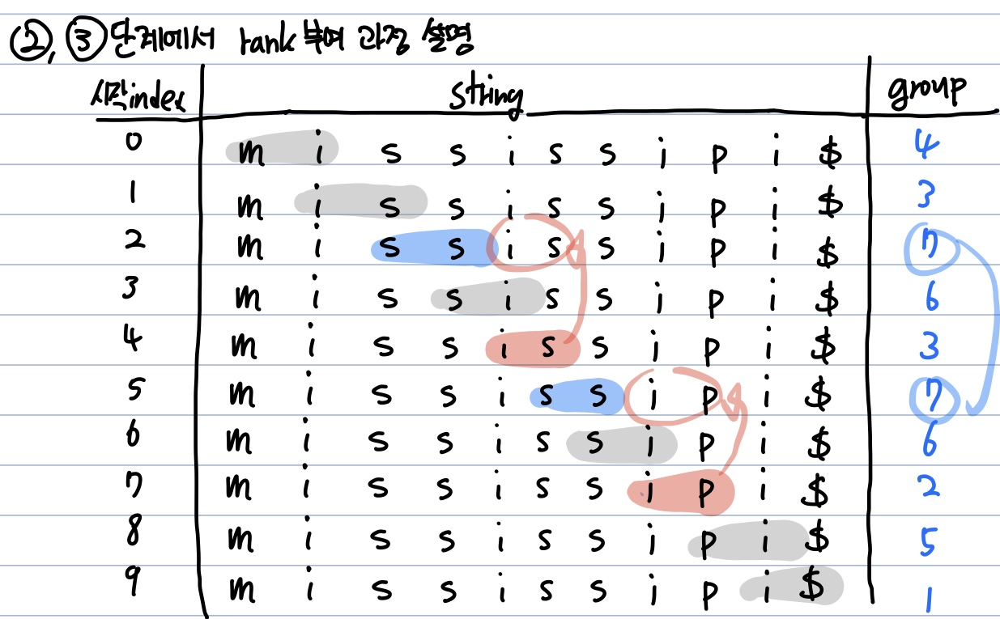

# 접미사배열(Suffix Array)

**Abstract**
  - 한 문자열의 접미사(Suffix)들을 모두 모아 정렬했을때, 그 순서를 문자열의 index로만 표현한 것

e.g)
**String** : mississipi  
<br/>
**Suffixes**
| index | 0 | 1 | 2 | 3 | 4 | 5 | 6 | 7 | 8 | 9 |
|:---:|:---:|:---:|:---:|:---:|:---:|:---:|:---:|:---:|:---:|:---:|
| suffix | 'mississipi' | 'ississipi' | 'ssissipi' | 'sissipi' | 'issipi' | 'ssipi' | 'sipi' | 'ipi' | 'pi' | 'i' |

**suffixes를 사전순으로 정렬**
| index | 9 | 7 | 4 | 1 | 0 | 8 | 6 | 3 | 5 | 2 |
|:---:|:---:|:---:|:---:|:---:|:---:|:---:|:---:|:---:|:---:|:---:|
| suffix | 'i' | 'ipi' | 'issipi' | 'ississipi' | 'mississipi' | 'pi' | 'sipi' | 'sissipi' | 'ssipi' | 'ssissipi' |  

**mississipip의 suffix array => *9741086352***

---
**구현 방법 1️⃣ - Brute Force**
  - string의 길이 n 만큼 suffixes를 따로 저장한 뒤 정렬
  - 정렬하는데 *O(nlogn)* + 정렬하기 위해 두 suffix를 비교하는데 *O(n)*
  - **O(n^2 * logn)** 의 시간복잡도  

---
**구현 방법 2️⃣ - Manber-Myers 알고리즘(Rank + Radix Sort)**
  1. 문자열 S를 범위가 1인 substring에 대해 사전순으로 정렬
  2. 정렬된 순서를 기준으로 grouping
  3. 범위를 2배 늘려 다시 정렬, 계속해서 2번과 3번 과정을 반복  
  => 정렬하는데 *O(nlogn)* + 길이를 두배씩 늘리면서 n까지 비교하므로 *O(logn)*  
  => **O(nlog * n^2)** 의 시간복잡도  
  
---
**Process**
  1. mississipi를 첫번째 글자(길이가 1인 substring)을 기준으로 정렬  

  | index | 0 | 1 | 2 | 3 | 4 | 5 | 6 | 7 | 8 | 9 |
  |:---:|:---:|:---:|:---:|:---:|:---:|:---:|:---:|:---:|:---:|:---:|
  | string[index] | m | i | s | s | i | s | s | i | p | i |
  | group | 2 | 1 | 4 | 4 | 1 | 4 | 4 | 1 | 3 | 1 |
  
  2. 범위를 2배로(길이가 2인 substring)을 기준으로 정렬  

  | index | 0..1 | 1..2 | 2..3 | 3..4 | 4..5 | 5..6 | 6..7 | 7..8 | 8..9 | 9..10 |
  |:---:|:---:|:---:|:---:|:---:|:---:|:---:|:---:|:---:|:---:|:---:|
  | string[index] | mi | is | ss | si | is | ss | si | ip | pi | i$ |
  | group | 4 | 3 | 7 | 6 | 3 | 7 | 6 | 2 | 5 | 1 |
  *( $ : **가장 마지막문자** 를 표현, **가장 높은순위** )*
  
  3. 범위를 2배로(길이가 4인 substring)을 기준으로 정렬  
  | index | 0..3 | 1..4 | 2..5 | 3..6 | 4..7 | 5..8 | 6..9 | 7..10 | 8..11 | 9..12 |
  |:---:|:---:|:---:|:---:|:---:|:---:|:---:|:---:|:---:|:---:|:---:|
  | string[index] | miss | issi | ssis | siss | issi | ssip | sipi | ipi$ | pi$$ | i$$$ |
  | group | 4 | 3 | 9 | 7 | 3 | 8 | 6 | 2 | 5 | 1 |
  
  **2단계와 3단계의 group 부여 과정 설명**  
  1. 2단계에서 group을 구하는 과정을 표로 정리하자면 다음과 같다.  
  
  
  2. 이때 동일한 rank값인 7을 갖는 group[2]와 group[5]를 비교하기 위해 빨간 부분을 가져와서 비교한다.  
  3. **중요** group[2]==group[5]이면, string[2..5]와 string[5...8]을 비교하는게 아니라 group[2 **+2** ]와 group[5 **+2** ]를 비교한다.  
  4. 이때 2와 5에 더한 2는 현재 substring의 길이(t)에 해당한다.   
  ***=>* substring자체를 비교한다면 최대 N번 비교해야하지만,  
     이 방식으로는 최대 2번만 비교할 수 있다(group[i]와 group[j] -> group[i+t]와 group[j+t]**   
  - substring의 길이가 4, 8, 16, ... 으로 늘어나더라도 최대 비교횟수는 2번이 된다.  
  - 따라서 매번 길이를 2배씩 늘리면서 group의 rank를 (최대 2번)비교하여 suffix array를 구할 수 있다.  


---
**Source Code**
- string이 'banana'일때의 아래의 소스코드로 suffix array를 구하는 과정 
```c
void getSuffixArray(const String s){ s = "banana"
  int n = s.size();
  int[] g = new int[n+1]; // group
  int[] SA = new int[n]; // suffix array
  int[] ng = new int[n+1]; // 현재 substring의 길이가 t일때 t*2 에 대한 group
  
  for(int i = 0; i < n; i++){
    SA[i] = i; // 정렬대상, 0부터 차례대로 넣어준다.
    g[i] = s[i] - 'a'; // 정렬기준(사전순), 문자열 s의 각 문자별로 번호를 넣어준다(b=1, a=0, n=13)
  }
  
  for(int t = 1; t <= n; t<<=1){
    g[n] = -1;
    bool cmp(int i, int j){
      if(g[i]==g[j] return g[i+t] <= g[j+t];
      else return g[i] < g[j];
    };
    
    sort(SA, SA+n, cmp); // g[]의 번호를 기준으로 SA를 정렬
    /*
    SA = [0, 1, 2, 3, 4, 5] -> SA = [5, 1, 3, 0, 2, 4];
    g = [1, 0, 13, 0, 13, 0 ,-1]
    t = 1
    */
    
    ng[SA[0]] = 0; // SA[0] = 5, 마지막 a에 해당
    // s[SA[1]] = s[SA[5]] = 'a'지만 다음 문자를 살펴보면 s[SA[1]] = 'an', s[SA[5]] = 'a$'이므로  
    // 5번째 index에 있는 a가 g를 기준으로 정렬했을 때 가장 앞에 오게 된다.
    ng[n] = -1;
    
    // 길이를 2배 늘렸을때 그룹 번호 배정
    for(int i = 1; i < n; i++){
      // e.g.) SA[0]과 SA[1]인 경우, g[SA[0]] = g[5] = 0, g[SA[1]] = g[1] = 0으로 같지만 g[6](= -1) < g[2](= 13)이므로 true를 반환
      if(cmp(SA[i-1], SA[i])
        ng[SA[i]] = ng[SA[i-1]] + 1;
        
      // 2*t만큼 substring을 비교해보아도 동일한 group이면 다음 t에서 다시 확인
      else{
        np[SA[i]] = ng[SA[i-1]];
      }
      
      
      // g를 ng로 갱신해주고 t를 2배로 늘리어 for loop를 반복
      for(int i = 0; i <= n; i++){
        g[i] = ng[i];
      }
    }
  }
}

```
**배열 g와 ng의 역할**  
예를들어, t = 2일때 현재 cmp는 길이가 2인 substring을 기준(정렬 기준이 g)으로 비교를 하게된다.  
다음 iter에선 t = 4인 substring을 기준으로 정렬을 하기위해서 현재 정렬 기준인 g를 보고 새로운 정렬 기준이 될 ng를 구한다.  

ng를 구하는 과정에서  
g를 기준으로 정렬된 SA의 원소를 비교해보면  

두 원소(SA[i]와 SA[i-1])에 대해  
1. SA[i-1] < SA[i] 이라면 SA[i]가 사전상으로 뒤에 오므로 새로운 정렬기준 ng도 이를 따르게 된다 **ng[i] = ng[i-1]+1**  
2. SA[i-1] == SA[i] 이고 t만큼 뒤에 있는 원소에 대해 SA[i-1+t] < SA[i+t] 라면 SA[i]가 사전상으로 뒤에 오므로 ng도 이를 따른다 **ng[i] = ng[i-1]+1**  
3. SA[i-1] == SA[i] 이고 t만큼 뒤에 있는 원소에 대해 SA[i-1+t] == SA[i+t] 라면 사전상으로 동일하므로 여기선 같은 group으로 두고 다음번 t에서 비교한다 **ng[i] = ng[i-1]**  
