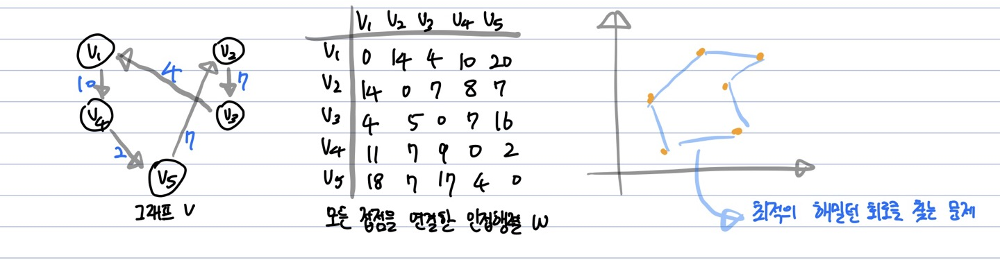

# 외판원 문제(Traveling Salesman Problem, TSP)

**Abstract**
  - 외판원이 출장시간을 줄이기 위해 거주하고 있는 도시에서 출발하여 모든도시를 한 번씩만 방문하고,  다시 출발한 도시로 돌아온다고 했을때 가장 짧은 여행길을 찾는 알고리즘
  - start node가 있고 (n-1)개의 node를 한 번씩만 거쳐 다시 start node로 돌아간다.

---
**방법 1️⃣ - Brute Force**
  - (n-1)개의 노드를 탐색하므로 (n-1) * (n-2) * (n-3) * ... * 2 * 1 = **(n-1)!** 의 시간복잡도

---
**방법 2️⃣ - 동적계획법(DP)** 
<br/>

  - A = v1을 제외한 V의 부분집합({}, {v2}, {v2, v3} ...)
  - D[Vi][A] = **1. Vi번 노드에서 시작**해서 **2. A의 모든 노드를 거친 후**, **3. 마지막 V1에 들렀을때 거리의 최솟값**
  - => Vi에서 A라는 부분집합에 있는 노드들을 거쳐 V1에 도달하는 최단 경로
  - e.g.) A = {V3, V4} 일때 D[V2][A] = min(length(V2, V3, V4, V1), length(V2, V4, V3, V1))

---
**일반화**
  - D[Vi][A] = minimum(j:Vj는 A의 원소)(W[i][j] + D[Vj][A-{Vj}], A != {}
  - D[Vi][A] = W[i][1], A == {}

  - V1에서 출발하여 모든 노드를 거쳐 V1으로 돌아오는 최소 거리
  - D[V1][A] = minimum(2<=j<=n)(W[1][j] + D[Vj][V-{V1, Vj}]
  - 부분집합 A 중 한 Vj를 고르고 W[1][j]에서 D[Vj][V-{V1, Vj}]를 거치는 최단경로
  
---
**Process**
1.  

2.  


---
**Pseudo Code**
```c
void Travel(int n, const number W[][], index P[][], number& minlength){
  index i, j, k;
  number D[1..n][subset of V-{V1}] // 행 : n-1, 열 : V에서 V1을 제외한 부분집합의 개수
  
  for(i = 2; i <= n; i++){ // 2번 노드 부터 시작
    D[i][{}] = W[i][1];
  }
  
  for(k = 1; k <= n-2; k++){
    for( {V-v1}의 부분집합 A 중 원소가 k개인 경우에 대해 ) {// n-1Ck
      for(i!=1이고 Vi가 A에 속하지 않은 모든 i에 대해){
        D[i][V-{Vi}] = min(W[i][j] + D[j][V-{Vi, Vj}]; // j는 부분집합 A에 속하는 node 번호(A의 원소)
        P[i][V-{Vi}] = 최소가 되는 j 값;
        minlength = D[1][V-{V1}];
      }
    }
  }
  
  // 위 for loop 에서 구한 D의 값을 이용하여
  // V1에서 출발해서 V1을 제외한 모든 원소를 방문하고 V1으로 가는 최소 경로를 계산
  D[1][V-{V1}] = min(W[1][j] + D[j][V-{V1, Vj}];
  P[1][V-{V1}] = 최소가 되는 j 값;
  minlength = D[1][V-{V1}];
}
```

---
**시간복잡도**
- k : 1부터 n-2(V1과 Vj를 제외한 모든 노드의 개수)까지
- n-1Ck : V의 부분집합 중 원소가 k개인 부분집합의 개수
- j : K의 개수만큼(최대 k)
- n-1-k : n개의 노드 중 1번 노드와 부분집합의 원소의 개수인 k를 제외한 모든 원소를 대상으로 경로를 탐색  
<br/>
  
 ***=> 따라서 (n-2) * (n-1Ck) * (k) * (n-1-k) 만큼의 시간복잡도를 갖는다.***

---
**방법 3️⃣ - 분기한정법(Branch and Bound)


vs DP  
  - DP를 이용한 TSP 알고리즘의 시간복잡도 -> O(n^2 * 2^n) 
  - *분기한정법*을 이용하면 **DP보단 효율적으로 찾을순 있으나**(방문하는 노드가 줄어듦) **최적의 경로가 아닐 수 있다.**  

---
**상태 공간 트리**

  - 각 마디는 출발경로 V1부터 일주여행 경로를 나타냄
  - 최적경로를 구하기 위해 동일한 branch에서의 경로를 모두 검사한뒤, 가장 비용이 짧은 일주여행 경로를 택한다.
  - 또한 n-2개의 노드만 방문하면 마지막으로 남은 노드 + 1번노드 를 방문하면 최종 결과와 동일하므로 Level N-2까지만 탐색하여도 결과를 얻을 수 있다.

---
**Process**
  1. 각 마디(노드)마다 **한계값(Bound)**를 구한다
  2. **현재 마디** 에서 **뻗어나가서 얻을 수 있는** 여행경로 **길이의 하한** 을 구한다 -> **lower bound를 보고 BFS**
  3. 현재 최소경로길이(minlength)보다 **한계값(Lower Bound)** 이 작은 경우 그 마디를 **유망(Promising)** 하다고 판단하여 탐색


위 그림을 예시로 들어본다면
<br/>  
*e.g.1) 시작지점에서의 한계값*  

> 어떤 경로라도 한 정점을 떠날때 선택한 이음선의 길이는
> 그 정점에서 나오는 가장 짧은 이음선의 길이보단 길다.
> 따라서, 각 정점 별 가장 짧은 이음선의 길이를 한계값으로 사용한다.
V1 = min(14, 4, 10, 20) = 4  
V2 = min(14, 7, 8, 7) = 7  
V3 = min(4, 5, 7, 16) = 4  
V4 = min(11, 7, 9, 2) = 2  
V5 = min(18, 7, 17, 4) = 4  

따라서 이때의 **lower bound는 4 + 7 + 4 + 2 + 4 = 21** 이다.
<br/>  
*e.g.2) 경로 V1, V2를 방문했을때*  
V1 = 14(이미 V1에서 V2로 이동했으므로)
V2 = min(7, 8, 7) = 7
V3 = min(4, 7, 16) = 4
V4 = min(11, 9, 2) = 2
V5 = min(18, 17, 4) = 4

이때의 **lower bound는 14 + 7 + 4 + 2 + 4 = 31** 이다.

  - V2에서 나오는 가장짧은 이음선을 구하는 경우
    - 다시 V1으로 돌아가면 모든 노드를 한번씩 방문할 수 없으므로 V1을 제외한 다른 경로에 대한 최단 경로를 구한다.

  - V3, V4, V5에서 나오는 가장 짧은 이음선을 구하는 경우
    - 다시 V2로 돌아가면 모든 노드를 한번씩 방문할 수 없으므로 V2를 제외한 다른 경로에 대한 최단 경로를 구한다.

---
**최종 결과**

모든 정점에 대해 Process를 반복하면 위와 같은 상태공간 트리를 그릴 수 있고  
Bracnh and Bound 알고리즘으로 구한 최소 경로는 30임을 알 수 있다.

**Detail**
  1. Level 1의 경우 위에서 구한 **Lower bound = 31**, **length**의 default값은 **INF**로 둔다.
  2. 1번에서 출발하는 **모든경로 [1, 2], [1, 3], [1, 4], [1, 5] 에 대한 Lower Bound**를 구하고, 각 Bound 값을 **우선순위 큐**에 넣는다.
  3. *큐의 맨 앞에는 가장 작은 bound 값*이 있으므로, 이 값을 **pop**한다. 
  4. **최소 bound를 갖는 경로는 [1, 3]** 이였으므로 **3번노드에서 나가는 모든 경로에 [1, 3, 2], [1, 3, 4], [1, 3, 5]에 대해 Lower bound를 구하고** 다시 **우선순위 큐**에 넣는다.
  5. *가장 앞에는 값을 pop*한다. 위 그림을 예시로 들었을때 이 값은 22이고 그 경로는 **[1, 3, 2]** 이다.
  6. 다시 **2번노드에서 나오는 경로를 구한다.** **[1, 3, 2, 4], [1. 3. 2. 5]**
  7. **n-2개의 노드는 모두 방문**하였으므로 **최종경로(현재까지의 경로 + 마지막 남은 노드 + 1번노드)를 구할 수 있고 minlength를 계산**한다.
  8. [1, 3, 2, 4] = [1, 3, 2, 4, 5, 1] = 37 / [1, 3, 2, 5] = [1, 3, 2, 5, 4, 1] = 31 이므로 **minlength는 31**이 된다.
  9. 현재 우선수위 큐에서 minlength보다 큰 값이 있다면 이 값은 더이상 **유망하지 않다(Non-Promising)** 고 판단하여 탐색 후보에서 제외한다.
  10. 다시 3번과정부터 반복하고 **큐의 남은 모든 bound 값이 현재 minlength보다 크다면 탐색을 최종 종료** 한다.

---
**참고한 곳**
- https://seungjuitmemo.tistory.com/111
- https://seungjuitmemo.tistory.com/92
- https://www.youtube.com/watch?v=Bclxkj-1CvE
