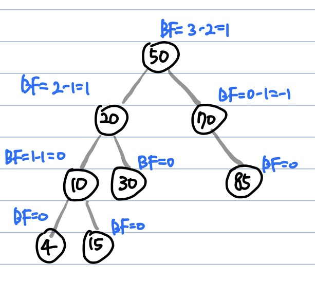
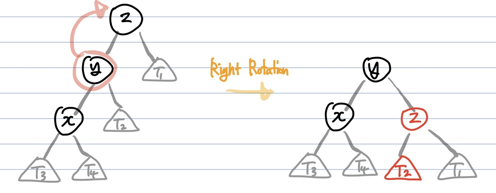
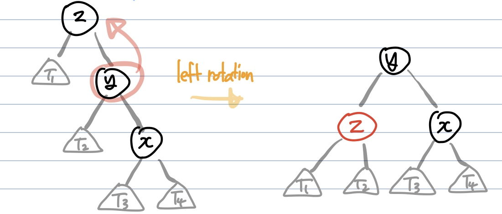
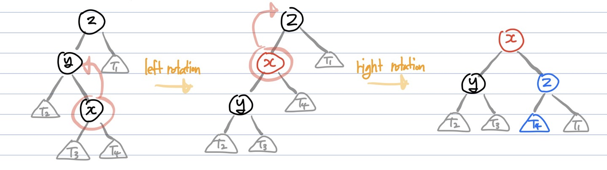
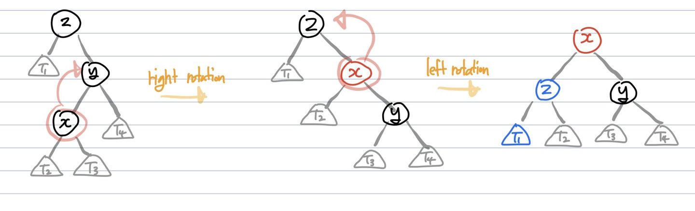

# AVL 트리
**Abstract**
  - **스스로 균형을 잡는** *이진탐색트리*
  - 트리의 높이가 h이고 불균등상태(*편향이진트리*)라면 이진탐색트리의 시간복잡도는 **O(h)**
  - 이를 방지하고자 **높이 균형을 유지하는 트리** 가 AVL 트리

---
**특징**
  - 이진탐색트리의 속성을 가짐
  - 왼쪽, 오른쪽 서브트리의 높이 차는 최대 h
  - 어떤 시점에서든지, 두 서브트리의 높이차이가 2이상이되면 **회전을 통해 균형을 맞춤**
  - AVL트리는 높이를 logN으로 유지하기 때문에 **삽입, 삭제, 검색의 시간복잡도는 O(logN)**

---
**Balance Factor(BF)**
  - 왼쪽 서브트리의 높이에서 오른쪽 서브트리의 높이를 뺸 값
    - Balance Factor(k) = height(left(k)) = height(right(l))
  1. BF = 1 : 왼쪽 서브트리의 높이가 오른쪽 서브트리의 높이보다 한 단계 높음
  2. BF = 0 : 왼쪽 서브트리의 높이와 오른쪽 서브트리의 높이가 동일
  3. BF = -1 : 왼쪽 서브트리의 높이가 오른쪽 서브트리의 높이보다 한 단계 낮음

*e.g.)*  

---
**시간복잡도**
  - 트리의 높이를 항상 logN(N은 노드의 개수)으로 유지하기 때문에, **삽입, 삭제, 검색의 시간복잡도는 O(logN)**

---
**회전(Rotation) 연산**
  - AVL 트리는 이진탐색트리의 일종이기 때문에 모든 작업은 이진탐색트리의 방식과 동일
  - 삽입/삭제를 하여 |BF| >= 2 (불균등상태)가 된다면 **불균형 노드를 기준으로 서브트리의 위치를 변경하는 Rotation 작업**을 수행하여 균형을 맞춤
  - Rotation은 LL, RR, LR, RL 4가지 case로 나뉨  

   

case 1️⃣) LL(Left Left)  
y는 z의 **왼쪽자식** , x도 y의 **왼쪽자식** 인 경우 **right rotation** 을 수행  
  

**Process**
  1. y노드의 오른쪽 자식 노드를 z노드로 변경
  2. z노드의 **왼쪽자식(기존 y)** 을 y노드의 **오른쪽 서브트리(T2)** 로 변경
  3. y는 새로운 parent, z는 y의 right child로 들어가게됨  

case 2️⃣) RR(Right Right)  
y는 z의 **오른쪽자식** , x도 y의 **오른쪽자식** 인 경우 **left rotation** 을 수행  
  

**Process**
  1. y노드의 왼쪽 자식 노드를 z노드로 변경
  2. z노드의 **오른쪽자식(기존 y)** 을 y노드의 **왼쪽 서브트리(T2)** 로 변경
  3. y는 새로운 parent, z는 y의 right child로 들어가게됨  

case 3️⃣) LR(Left Right)  
y는 z의 **왼쪽자식** , x는 y의 **오른쪽 자식** 인 경우 **먼저 left rotation을 수행한 뒤 right rotation** 을 수행  
  
 
case 4️⃣) RL(Right Left)  
y는 z의 **오른쪽자식** , x는 y의 **왼쪽 자식** 인 경우 **먼저 right rotation을 수행한 뒤 left rotation** 을 수행  
  

---
**AVL 트리 vs. Red-Black 트리**
  - AVL 트리
    - 더욱 엄격한 균영(|BF| < 2), Red-Black 트리보다 더 빠른 조회를 제공
    - 각 노드별로 BF를 저장해야하므로 노드마다 int(4byte) 자료형 만큼의 저장 공간이 필요
    - 더 빠른 검색이 필요한 경우(데이터베이스 인덱싱, 파일시스템)에서 사용
  - Red-Black 트리
    - 상대적으로 느슨한 균형(두 서브트리의 높이 차이가 최대 2배)으로 인해 회전이 거의 이루어지지 않음
    - AVL 트리보다 삽입/삭제가 용이
    - 검정 혹은 빨강색만 표현하면 되므로 노드당 1비트만 필요(비트반전)
    - 대부분의 언어 라이브러리(map, C++의 멀티캐스트, Java의 treeMap)에서 사용

---

**참고한 곳**
  - https://yoongrammer.tistory.com/72#LL(Left_Left)_case
