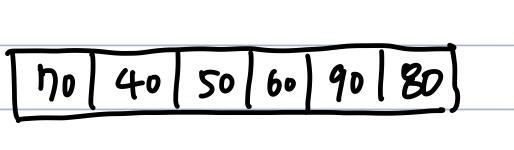
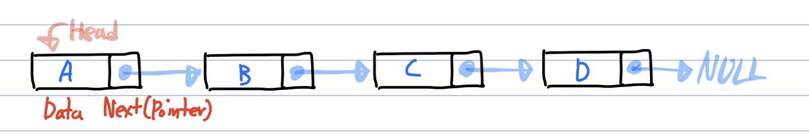

# Array VS. Linked List
**Array**  

  - index로 빠르게 값을 탐색(**O(1)**)
  - 선언시 **크기와 데이터 타입** 을 지정해야함 -> **연속적인 메모리 공간을 미리 할당하여 사용하는 자료구조**
  - 사이즈가 정적임기 때문에 최대 사이즈를 알 수 없을때 부적합(추가적인 공간을 할당하고 전부 옮겨줘야함)

---
**Linked List**  

  - 한 노드에 연결될 노드를 포인터로 가리키는 자료구조
  - 탐색은 오래 걸리지만(**O(n)**), 삽입/삭제가 용이(**O(1)**)
