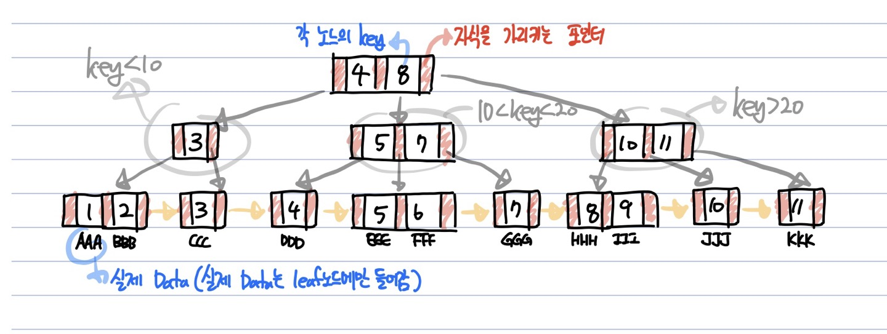

# B+ Tree
  - 데이터의 빠른 접근을 위해 **비단말(Non Leaf) 노드는 인덱스 역할만 수행**
  - B 트리 *+* Leaf 노드들의 데이터는 연결리스트로 표현된 색인 구조
  - 실제 DB에서 사용하는 인덱싱
  - **Index 부분** 과 **Leaf Node로 구성된 순차 데이터 부분** 으로 이루어짐
  - 인덱스 부분의 key값은 leaf에 있는 key값을 직접 찾아가는데 사용함
  - leaf 노드는 연결리스트 형태, 선형 검색이 가능

---
  
**특징**
  1. 루트노드는 적어도 2개 이상의 자식을 가져야함
  2. 루트노드를 제외한 모든 노드는 **M/2개 부터 M개의 자식을 가짐**
  3. 노드에는 **최소 [M/2]-1개 부터 최대 M-1개의 키를 포함**
  4. 노드의 자료수(key)가 x개라면, 자식수는 x+1개 여야함
  5. 최소 차수는 자식수의 하한값을 의미, 최소차수가 t라면 M = 2 * t - 1 (최소차수 t가 라면 3차 B트리, key의 하한은 ceil(3/2)-1 = 1개)

---
**B트리와의 차이점**
  - **모든 data가 leaf node에만 모여있음**, B트리의 경우 각 노드(key)마다 data를 저장
  - **모든 리프노드가 연결리스트로 연결**
    - B트리는 옆에있는 리프노드를 검사할때 다시 루트노드부터 검사해야하지만, **B+ 트리는 리프노드에서 선형검사를 할 수 있어 시간복잡도가 굉장히 줄어듦**

---
# key 탐색, 삽입, 삭제 과정 추가예정
---
**참고한곳**
  - https://gyoogle.dev/blog/computer-science/data-structure/B%20Tree%20&%20B+%20Tree.html
  - https://velog.io/@emplam27/%EC%9E%90%EB%A3%8C%EA%B5%AC%EC%A1%B0-%EA%B7%B8%EB%A6%BC%EC%9C%BC%EB%A1%9C-%EC%95%8C%EC%95%84%EB%B3%B4%EB%8A%94-B-Plus-Tree
