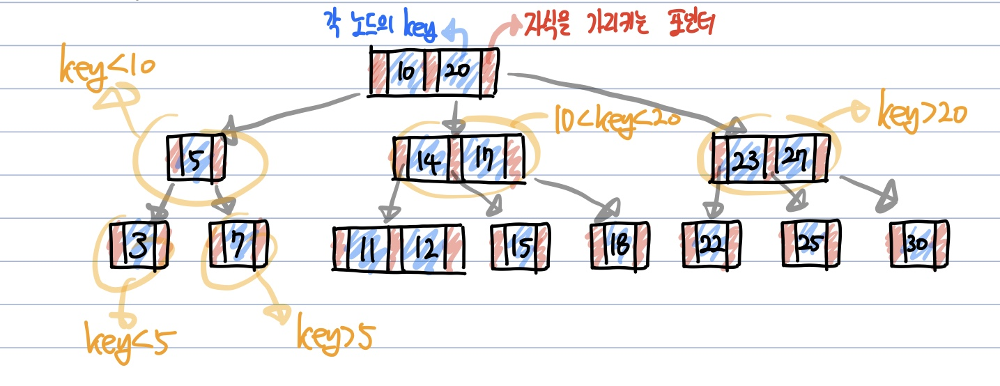

# B-Tree
  - 이진트리는 하나의 부모가 두개의 자식밖에 갖지 못하고, 균형이 맞지 않으면 검색 효율이 **선형(O(N))** 으로 떨어진다.
  - 하지만 이진트리가 균형만 맞다면 **검색, 삽입, 삭제 모두 O(logN)** 으로 보이는 장점이 있다.

**Abstract**
  - DB, 파일시스템에서 널리 쓰이는 트리 자료구조의 일종
  - 이진트리를 확장해서, 더 많은 수의 자식을 가질 수 있게 일반화 시킨 것이 **B-Tree**
  - 자식수에 대해 일반화를 진행하면서, 하나의 레벨에 자식을 더 많이 저장하는 것이 아니라 **트리의 균형을 자동으로 맞추는 로직까지 구현**
  - 단순하고 효율적, 레벨로만 따지만 완전히 균형을 맞춘 트리
  - 멀티레벨 인덱싱을 통해 빠른 검색이 가능

---
**규칙**  
 
M차 B 트리 ➡️ **최대 M개의 자식** 을 가질 수 있는 B 트리
  1. 루트노드는 적어도 2개 이상의 자식을 가져야함
  2. 루트노드를 제외한 모든 노드는 **M/2개 부터 최대 M개의 자식을 가짐**
  3. 노드에는 **최소 [M/2]-1개 부터 최대 M-1개의 키를 포함**
  4. 노드의 자료수(key)가 x개라면, 자식수는 x+1개여야함
  5. **최소 차수는 자식수의 하한값** 을 의미, 최소 차수가 t라면 M = 2 * t - 1 (최소차수 t가 2라면 M = 3차 B 트리, key의 하한은 1개)

  - 각 노드의 자료는 정렬된 상태여야함 **(정렬된 순서를 보장)**
  - 외부 노드(External Node)로 가는 경로의 길이는 모두 같음 **모든 leaf node는 동일한 level을 가짐**
  - 입력 자료는 중복될 수 없음  

e.g.) 3차 B 트리  

# Key 탐색, 삽입, 삭제과

---
**참고한곳**
  - https://gyoogle.dev/blog/computer-science/data-structure/B%20Tree%20&%20B+%20Tree.html
  - https://velog.io/@emplam27/%EC%9E%90%EB%A3%8C%EA%B5%AC%EC%A1%B0-%EA%B7%B8%EB%A6%BC%EC%9C%BC%EB%A1%9C-%EC%95%8C%EC%95%84%EB%B3%B4%EB%8A%94-B-Tree
