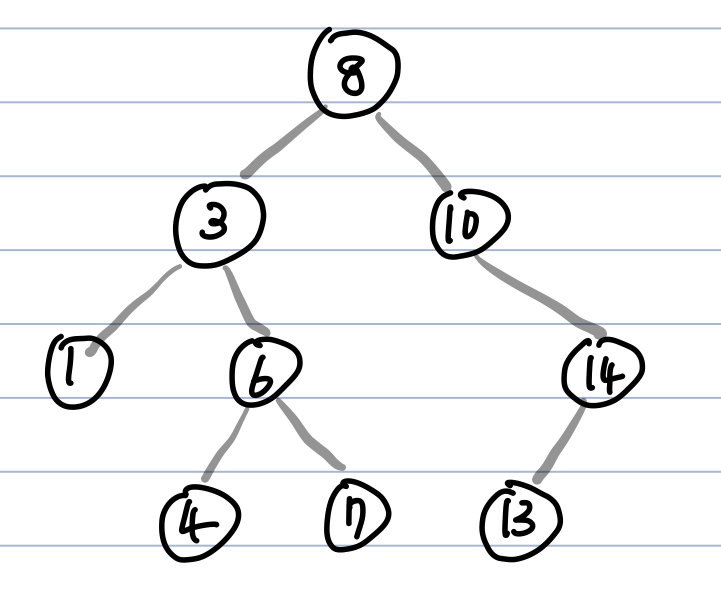

# 이진 탐색 트리(Binary Search Tree, BST)
  - **이진 탐색** 과 **연결 리스트** 의 장점을 결합

**Abstract**
  - 이진탐색 : **탐색에 소요되는 시간복잡도는 O(logN)**
  - 연결리스트 : **삽입, 삭제의 시간복잡도는 O(1)**, 탐색의 시간복잡도는 O(n)  

  => 두가지를 합하여 장점을 모두 취하는 것이 **이진탐색트리**  
  => 효율적인 탐색을 하며, 자료의 삽입/삭제도 용이하게 하기 위함
  
---
**특징**  

  - 모든 노드의 자식은 2개 이하
  - 모든 노드의 왼쪽 자식은 부모보다 작고, 오른쪽 자식은 부모보다 큼
  - **중복된 노드가 없어야함**

**중복된 노드가 없어야 하는 이유**
  - 검색목적 자료구조인데, 굳이 중복이 많은 경우에 BST를 사용하여 검색속도를 느리게 할 필요가 없음
  - 중복이 많다면 트리에 삽입하는 것보다, Count를 두어 처리하는 것이 훨씬 효율적

---
**Tree 순회**
  - 중위순회(In-Order)방식 (Left child -> Parent -> Right child)
  - 중위순회로 **정렬된 순서를 읽을 수 있음**

---
**BST의 핵심연산**
  - 검색, 삽입, 삭제, 트리생성, 트리삭제

---
**시간 복잡도**
  - 균등 트리 : **O(logN)**
  - 편항 트리 : **O(N)**  
  *=>* **트리의 Depth와 비례**  
 
편향된 트리(정렬된 상태 값을 트리로 만들면 한쪽으로만 뻗음)는 시간복잡도가 O(N)이므로 트리를 사용할 이유가 사라짐  
 → 이를 바로 잡도록 도와주는 개선된 트리가 **AVL Tree, RedBlack Tree**  
 
---
**노드 삭제**
  case 1. 자식이 없는 leaf 노드 일때 => 그냥 삭제
  case 2. 자식이 1개인 노드 일때 => 삭제 후 지워진 노드 자리에 자식을 올린다
  case 3. 자식이 2개인 노드 일때 => 삭제 후 오른쪽 자식에서 가장 작은 값 or 왼쪽 자식에서 가장 큰 값을 올린다.
    **"모든 노드의 왼쪽 자식은 부모보다 작고, 오른쪽 자식은 부모보마 큼"을 유지한다**
