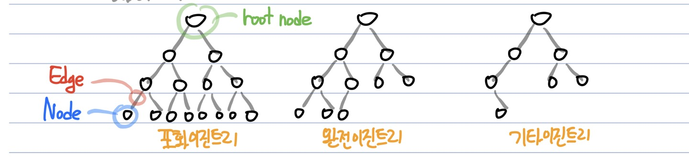
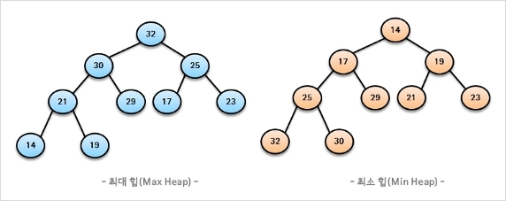

# 힙(Heap)
**Abstract**
  - **우선순위 큐** 를 위해 만들어진 자료구조
  - **완전 이진 트리** 의 일종(여러 값 중, 최댓값과 최솟값을 빠르게 찾아내도록 만들어진 자료구조)
  - 반정렬 상태(느슨한 정렬상태)
  - 힙트리는 중복허용, 이진 탐색 트리는 중복허용 X

**우선순위 큐**
  - 우선순위 개념을 큐에 도입한 자료구조
  - 큐의 데이터들이 우선순위를 가지고 있고, 우선순위가 높은 데이터가 먼저 나감
  - 배열, 연결리스트, 힙으로 구현할 수 있는데 **힙(heap)이 가장 효율적**

**완전 이진 트리**  

  - 마지막 레벨을 제외한 모든 레벨이 완전히 채워져있는 트리

---
**적합할 때**
  - 시뮬레이션 시스템, 작업 스케줄링, 수치해석 계산

---
**힙의 종류**  
 
  1. 최대힙(Max Heap)
    - 부모노드의 키 값이 자식 노드의 키 값보다 **크거나 같은 *완전이진트리***

  2. 최소힙(Min Heap)
    - 부모노드의 키 값이 자식 노드의 키 값보다 **작거나 같은 *완전이진트리***

---
**구현**
  - 힙을 저장하는 표준적인 자료구조는 **배열**
  - 편의상 0번 index는 사용하지 않음
  - 특정 위치의 노드 번호는 새로운 노드가 추가되어도 변하지 않음(e.g.) 1번 노드의 오른쪽 자식 노드 번호는 항상 3)
  - 부모 노드와 자식 노드의 관계
    - 부모노드 index = (자식노드의 index) / 2
    - 왼쪽자식노드의 index = (부모노드의 index) * 2
    - 오른쪽자식노드의 index = (부모노드의 index) * 2 + 1

---
**연산**
  - 삽입
    1. 일단 새로운 노드를 **힙의 마지막 노드에 삽입**
    2. 최대(MinHeap이면 최소)조건을 만족하는 동안 부모노드와 swap

  - 삭제
    1. root 노드를 삭제(최대힙에서 삭제연산은 최댓값요소를 삭제하는 것)
    2. 삭제된 root 노드에는 힙의 마지막 노드를 가져옴
    3. root 노드부터 차례대로 부모노드를 left child와 right child 중 큰 값과 swap => 다시 교환된 child를 부모 노드로 두고 반복
      - 부모노드가 두 자식보다 크다면(MinHeap이면 작다면) 
