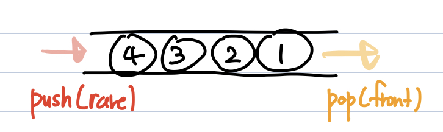

# 큐(Queue)
**Abstract**  

  - **FIFO(선입선출)** : 가장 먼저 들어온 것이 가장 먼저 나옴
  - *입력과 출력을 한 쪽 끝으로* 제한
  - **Front -> 큐의 가장 첫원소**, **Rare -> 큐의 가장 마지막 원소**
  - 들어올 때는 rare로 들어오지만, 나올 때는 front부터 빠지는 특성
  - 가장 첫 원소와 가장 마지막 원소로만 접근 가능

---
**적합할 때**
  - Buffer, BFS, ...

---
**원형 큐**
  - 논리적으로 배열의 처음과 끝이 연결되어 있는 것으로 간주하는 큐
