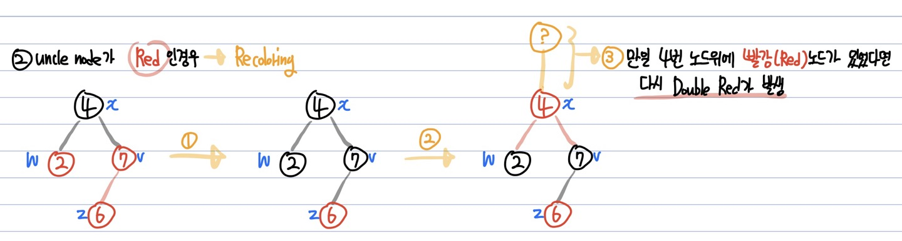

# Red-Black 트리(Red-Black Tree)
**Abstract**
  - 불균등상태를 방지하기 위해 균형을 맞추는 *이진탐색트리* 의 일종
  - 레드블랙트리의 Search는 O(logN)

---
**조건**
  1. Root Property: 루트 노드의 색깔은 **검정(Black)** 이다.
  2. External Property : 모든 External Node(자식이 없는 노드)의 색깔은 **검정(Black)** 이다.
  3. Internal Property : **빨강(Red)** 노드의 자식은 **검정(Black)** 이다. **(= No Double Red, 빨강 노드는 연속해서 나올 수 없다.)**
  4. Depth Property : 모든 leaf 노드에서 **Black Depth는 같다**
    - 모든 leaf 노드에서 root 노드까지 가는 경로에서 만나는 **검정(Black)색 노드의 개수**는 같다.

---
**Restructuring & Recoloring**
  - Double Red를 해결하는 2가지 전략

*e.g.)* 삽입하는 Node의 색은 항상 **Red**  
  
- 현재 insert된 node의 **uncle node**(부모노드의 형제 노드) **의 색깔에 따라 전략이 달라짐**

1. uncle node가 **Black**인 경우 ➡️ **Restructuring**  
  - insert된 노드(z), parent node(v), uncle node(w)를 대상으로 Restructuring을 진행

  
  1. 나, 부모, 부모의 부모를 오름차순으로 정렬
  2. 무조건 가운데 있는 값을 부모로, 나머지 둘을 자식므로 만듦
  3. 올라간 가운데 있는 값을 **검정(Black)** 으로 두 자식은 **빨강(Red)** 으로 만듦

  - 다른 서브트리에 영향(Depth Property)를 주지 않기 때문에 한 번의 Restructuring으로 끝남

  1. 위 예시에서 w노드를 보면 알 수 있듯이, Double Red를 해결하기 전후의 Black노드의 개수는 동일하기 때문에 다른 서브트리의 Black Property에 영향을 끼치지 않는다.
  2. 한 번의 Restructuring으로 끝나므로 이 자체는 O(1)의 시간복잡도 하지만, Double Red는 한 노드가 insert된 뒤 발생하므로 **총 수행시간은 O(log(n))**
    - 어떤 node가 insert될 자리를 찾아야 하므로 logN의 시간이 소요

2. uncle node가 **Red**인 경우 ➡️ **Recoloring**  
  - insert된 노드(z), parent node(v), grand parent node(x)를 대상으로 Recoloring을 진행

   
  1. 현재 insert된 노드(z)의 parent node(v)와 uncle node(w)를 **검정(Black)** 로 변경
  2. Grand Parent Node(x)를 **빨강(Red)** 로 변경
  3. Grand Parent Node가 Root Node가 아니라면(만일 Grand Parent위에 Red Node가 있었다면) **다시 Double Red가 발생할 수 있다.**

  - Black Depty는 일제히 1만큼 늘어나기 때문에 Depth Property를 만족

---
**시간 복잡도**
탐색 - O(logN)  
삽입 - O(logN)
  - Restructuring은 한 번만일어나므로 O(1), Recoloring은 다시 Double Red가 반복될 수 있으므로 최악의 경우 O(logN)
  - 아무튼, 두 연사은 어떤 node를 insert한 뒤에 일어나고, insert 될 자리를 찾는데 최대 logN만큼 탐색한다.
  - 따라서, Restructuring을 하든 Recoloring을 하든 **총 수행시간은 O(logN)**

---
**Red Black Tree가 Balanced 한 이유**
- 4번 조건(Depth Property)에 의해 Black Depth는 항상 같아야한다.
- 이때, root로부터 **거리가 가장짧은 external node(1️⃣)** 와 가장 긴 **external node(2️⃣)** 를 비교  
**1️⃣** : root부터 external node까지 거리가 가장 짧다 => Black Node만 존재하는 경우 **(length = n)**  
**2️⃣** : root부터 external node까지 거리가 가장 길다 => Black Node와 Red Node가 번갈아(검정->빨강->검정->빨강->...->검정) 존재하는 경우 **(length = 2 * n)**
- 1번 case와 2번 case의 길이는 2배차이. **따라서 Red-Black 트리의 서브트리간 높이 차이는 최대 2배이다**
- **Red-Black 트리의 높이는 항상 logN**

---
**참고한곳**
  - https://zeddios.tistory.com/237
