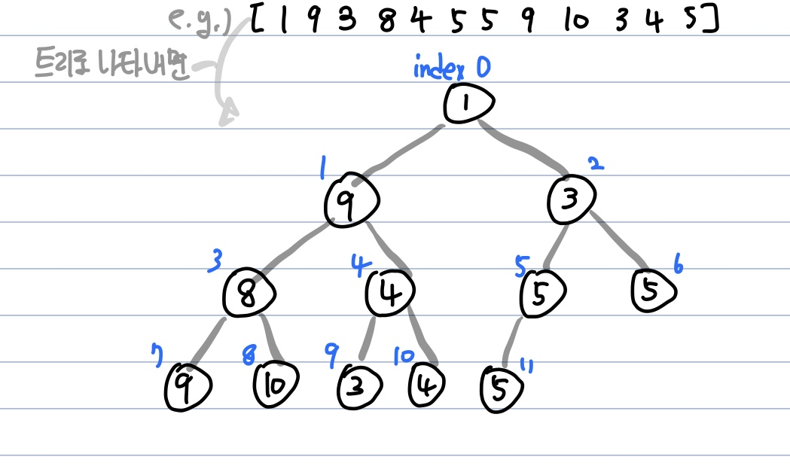
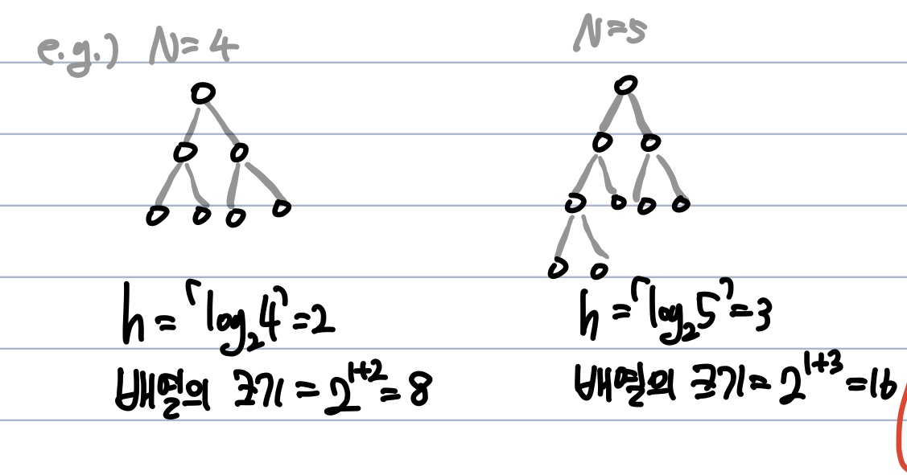
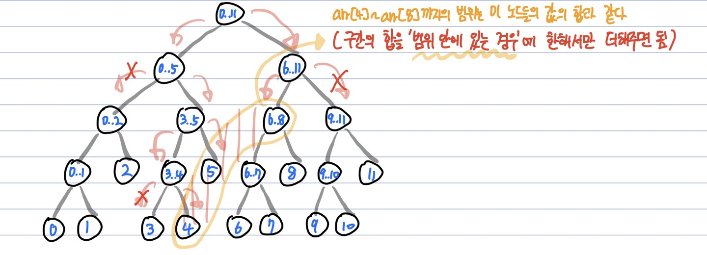
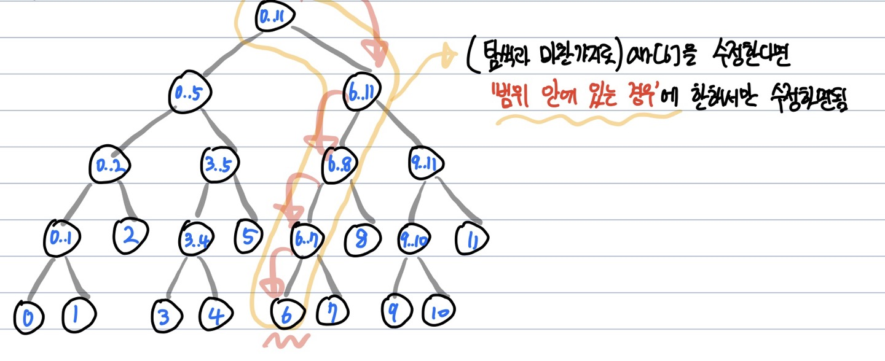

# 세그먼트 트리(Segment Tree)
  - 여러개의 데이터가 연속적으로 존재할 때 **특정한 범위에 속하는 데이터들의 합**을 구하는 방법

---
**방법 1️⃣** 단순 배열을 이용해 선형적으로 구하기  
e.g.) [5 8 7 3 2 5 1 8 9 7 3]  
- 데이터를 순차적으로 하나씩 더하므로 **O(n)** 의 시간복잡도

| index | 0 | 1 | 2 | 3 | 4 | 5 | 6 | 7 | 8 | 9 | 10 | 11 |  
|:---:|:---:|:---:|:---:|:---:|:---:|:---:|:---:|:---:|:---:|:---:|:---:|:---:|
| array | 5 | 8 | 7 | 3 | 2 | 5 | 1 | 8 | 9 | 8 | 7 | 3 |  

---
**방법 2️⃣** 트리 구조를 이용하여 구하기
  - 각 노드마다 구간합을 저장하여, 트리의 특성상 **O(logN)** 의 시간복잡도  

  

**구간합 트리 생성**   
  

---
**트리 배열의 크기**
  - 기존 배열의 크기 => **N = Segment Tree에서 leaf node의 개수**
  - Leaf node가 N개면 트리의 깊이는 **H** => **ceil(logN)**
  - 배열의 크기 => 2^(h+1) **트리 노드의 개수는 a0 = 1, a1 =2, 공비 r = 2인 등비수열, 따라서 1+2+4+...+2^h = 1 + (2 * 2^h -1 ) / (2 - 1) = 2^h+1)

  
**포화이진트리일때 깊이가 3이면 총 15개의 노드가 존재한다. 남는 (2^(3+1) = 16) 1개는 사용하지 않는 0번 index)**

---
**연산**
  - 구간합 탐색
  
```c
int sum(int index, int start, int end, int left, int right){
  // 구간합을 구할 범위 : left, right / 노드의 시작과 끝 index : start, end

  // 구간합을 구할 범위가 현재 노드의 범위 밖에 있는 경우
  if(left > end || right < start) {
    return 0; // 무시
  }

  // 구간합을 구할 범위 안에 현재 노드의 범위가 속하는 경우
  if(left <= start && right >= end) {
    return tree[node]; // 현재 부분합을 그대로 반환
  }

  // 구간합을 구할 범위가 현재 노드의 범위와 일부 겹치는 경우
  // 혹은 구간합을 구할 범위가 현재 노드 범위 안에 있는 경우
  else {
    int mid = (left + right)/2;
    return sum(index*2, start, mid, left, right) + sum(index*2 + 1, mid+1, end, left, right);
  }
}
```

  - 구간합 수정
  
```c
void update(int start, int end, int node, int index, int diff){
  // start, end : 현재 범위의 시작과 끝 인덱스
  // index : 구간합을 수정하고자 하는 배열의 인덱스
  // node : 현재 노드 번호
  // diff : 수정할 값 

  // 수정할 노드의 인덱스가 현재 범위 밖에 있는 경우
  if(index < start || index > end) return; // 무시
  
  // 수정할 노드의 인덱스가 현재 범위에 속하는 경우
  tree[node] += diff; // 누적합 값 수정
  int mid = (left + right) / 2
  update(start, mid, node * 2, index, diff);
  update(mid + 1, end, node * 2 + 1, index, diff);
  }
}
```

**=> 탐색/수정에 대해 각 노드가 구간합을 가지고 있으므로 _O(logN)_ 의 시간복잡도**

---
**참고한 곳**
  - https://ssungkang.tistory.com/entry/Algorithm-%EC%84%B8%EA%B7%B8%EB%A8%BC%ED%8A%B8-%ED%8A%B8%EB%A6%ACSegment-Tree
  - https://blog.naver.com/ndb796/221282210534
