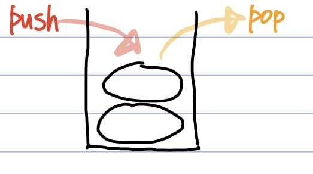
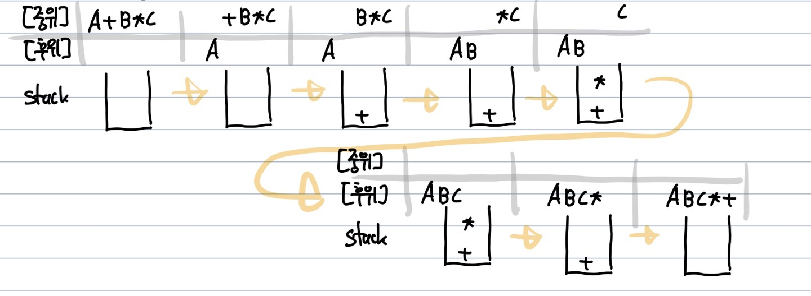

# 스택(Stack)
**Abstract**  

  - **LIFO(후입선출)** : 가장 나중에 들어온것이 가장 먼저 나옴
  - 연산 : 삽입(push), 삭제(pop), 비어있는지 확인(isEmpty), 꽉 차 있는지 확인(isFull), SP(Stack Pointer, 스택의 가장 마지막원소를 가리킴)

---
**적합할 때**
  - 함수의 콜스택, 문자열 역순 출력, 연산자 후위 표기법

*연산자 후위 처리 e.g.)* **A+B*C**
1. 중위 표기식를 순차적으로 탐색하며 연산자는 스택에 넣고, 피연산자는 후위 표기식으로 넘긴다
2. 피연산자를 모두 후위 표기식으로 넘겼다면 스택에서 연산자를 차례대로(위에서부터) pop한다.

---
**참고한 곳**
  - https://velog.io/@inyong_pang/12%EA%B0%95-%EC%8A%A4%ED%83%9D%EC%9D%98-%EC%9D%91%EC%9A%A9-%EC%88%98%EC%8B%9D%EC%9D%98-%ED%9B%84%EC%9C%84-%ED%91%9C%EA%B8%B0%EB%B2%95Postfix-Notation
