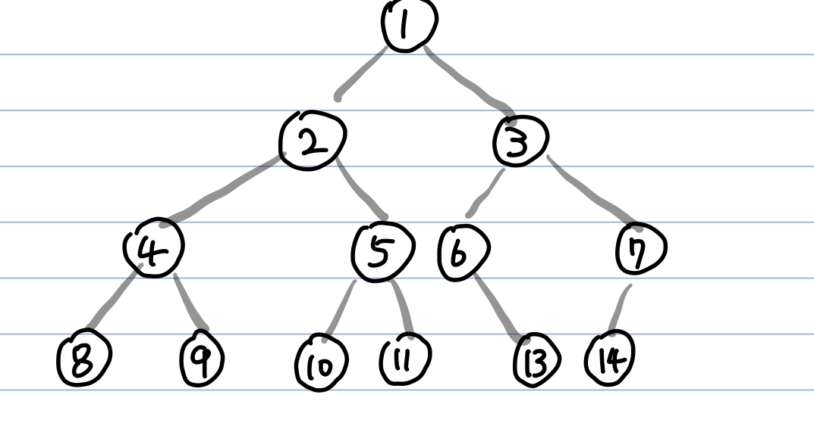

# 트리(Tree)
**Abstract**  

  - **Node** 와 **Edge** 로 이루어진 자료구조
  - Cycle이 존재하지 않는다.(Cycle이 존재한다면 트리가 아니라 그래프)
  - 모든 노드는 자료형으로 표현 가능
  - 루트에서 어떤 노드로 가는 경로는 유일(오직 1개)
  - 노드가 N개면 간선은 N-1개를 갖는다.

---
**순회 방식**  

1. 전위순회(Pre-Order)
    - **Parent -> Left child -> Right child** 순으로 방문
    - 1 ➡️ 2 ➡️ 4 ➡️ 8 ➡️ 9 ➡️ 5 ➡️ 10 ➡️ 11 ➡️ 3 ➡️ 6 ➡️ 13 ➡️ 7 ➡️ 14

2. 중위순회(In-Order)
    - **Left Child -> Parent -> Right child** 순으로 방문
    - 8 ➡️ 4 ➡️ 9 ➡️ 2 ➡️ 10 ➡️ 5 ➡️ 11 ➡️ 1 ➡️ 6 ➡️ 13 ➡️ 3 ➡️ 14 ➡️ 7

3. 후위순회(Post-Order)
    - **Left child -> Right child -> Parent** 순으로 방문
    - 8 ➡️ 9 ➡️ 4 ➡️ 10 ➡️ 11 ➡️ 5 ➡️ 2 ➡️ 13 ➡️ 6 ➡️ 14 ➡️ 7 ➡️ 3 ➡️ 1

4. 레벨순회(Level-Order)
    - **Root부터 각 Level 별로** 방문
    - 1 ➡️ 2 ➡️ 3 ➡️ 4 ➡️ 5 ➡️ 6 ➡️ 7 ➡️ 8 ➡️ 9 ➡️ 10 ➡️ 11 ➡️ 13 ➡️ 14
