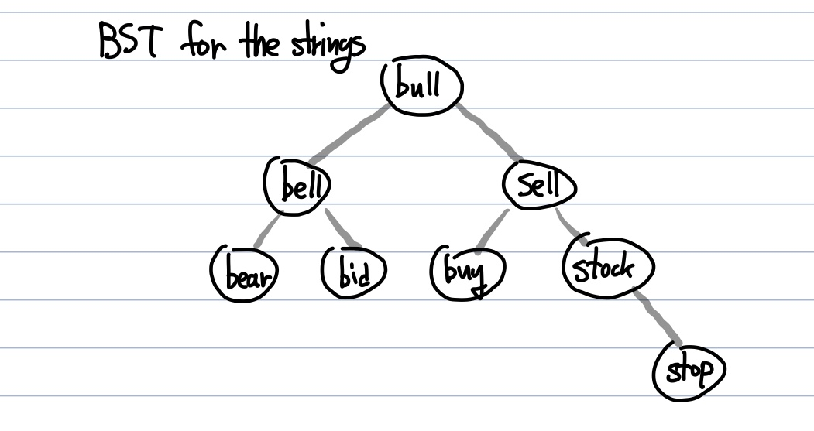
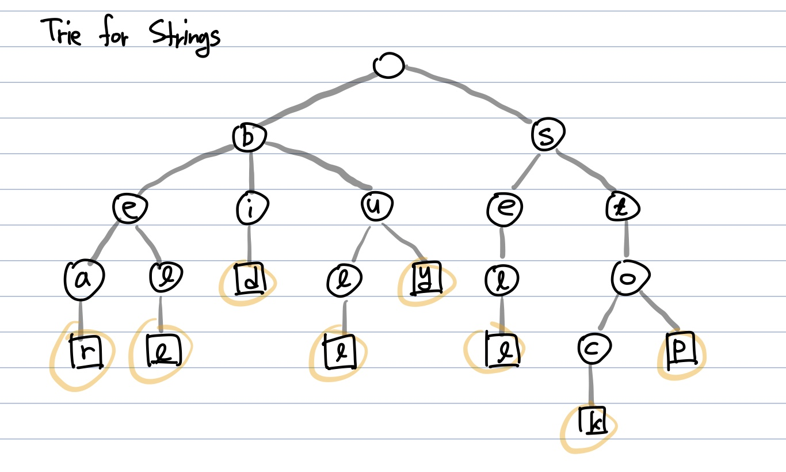

# 트라이(Trie)
  - 문자열에 대한 검색을 빠르게 도와주는 자료구조

**Abstract**
  - 문자열에 대해 **이진탐색트리**를 적용하면 ➡️ **문자열의 길이(M) + 문자열의 총 개수(O(log(N))** ➡️ **O(Mlog(N))** 의 시간복잡도
  - 트라이를 적용하면 ➡️ **O(M)** 으로 문자열 검색이 가능

---
**e.g.) [bear, bell, bid, bull, buy, sell, stack, stop]** (N = 8)  
BST for Strings  

  - 문자열의 개수(N)만큼 비교하기 때문에 O(logN)
  - 가장 길이가 긴 문자열의 길이가 M이라면 두 문자열을 비교하는데 O(M)
  - **총 O(MlogN)의 시간복잡도**  
    
    
Trie for Strings  

  - **트라이(Trie)를 활용** 한 Tree의 leaf node의 갯수는 문자열의 총 개수(N)과 동일하다
  - **O(M)의 시간복잡도** (가장 길이가 긴 Strings의 길이(M)만큼만 탐색하면 된다)

---
**특징**
  - 문자열을 단순하게 하나씩 비교할때보다 훨씬 **효율적**
  - 각 노드는 자식에 대한 포인터를 모두 저장하므로 **공간을 많이 차지**
  - O(포인터 크기 * 포인터 개수 * 총 노드의 개수)만큼의 공간을 차지한다.

---
**적합할 때**
  - 검색어 자동완성, 사전에서 단어 찾기, 문자열 검사
  - 각 노드에 저장할 필요 없이 문자열의 접두사를 얻을 수 있다.(지나온 경로가 곧 그 문자열의 접두사들)
